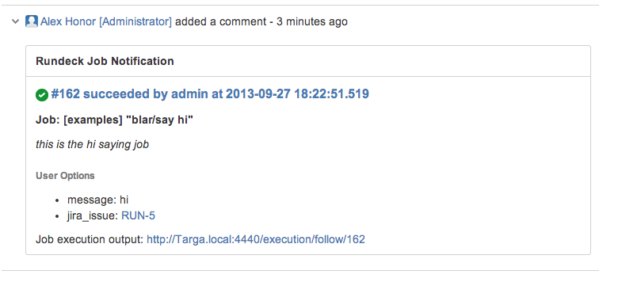

## Description

This Notification plugin will append job status as a comment to a Jira ticket.

Here's a screenshot of the notification:



Big props to [rcarz](https://github.com/rcarz) and his fantabulous
[jira-client](https://github.com/rcarz/jira-client) that made this plugin possible.


## Build / Deploy

To build the project from source, run: `gradle build`.
The resulting jar will be found in `build/libs`.

Copy the  jar to Rundeck plugins directory. For example, on an RPM installation:

    cp build/libs/jira-notification-1.0.0.jar /var/lib/rundeck/libext

or for a launcher:

    cp build/libs/jira-notification-1.0.0.jar $RDECK_BASE/libext

Then restart the Rundeck service.

## Configuration

The Jira connection credentials are set in the project.properties file
for your project.

```
project.plugin.Notification.JIRA.login=slomo
project.plugin.Notification.JIRA.password=s1inky
project.plugin.Notification.JIRA.url=https://myOnDemand.atlassian.net
```

## Usage

To use the plugin, configure your job to send a notification
for on start, success or failure.

The plugin has one input option:

* issue: The JIRA issue ID.

## Example

The example job below sends a notification on start.
Note, the JIRA issue ID is passed as a job option:

```YAML
- id: a3528977-cc67-4d50-97d4-729845c643b9
  name: say hi
  description: this is the hi saying job
  project: examples
  loglevel: INFO
  multipleExecutions: true
  sequence:
    keepgoing: false
    strategy: node-first
    commands:
    - script: |-
        #!/usr/bin/env python
        print 'this is a python script'
  notification:
    onstart:
      plugin:
        type: JIRA
        configuration:
          issue: '${option.jira_issue}'
  options:
    jira_issue:
      required: true
      description: 'the JIRA issue '
  uuid: a3528977-cc67-4d50-97d4-729845c643b9
```

## Troubleshooting

Errors from JIRA communication can be found in Rundeck's service.log.
